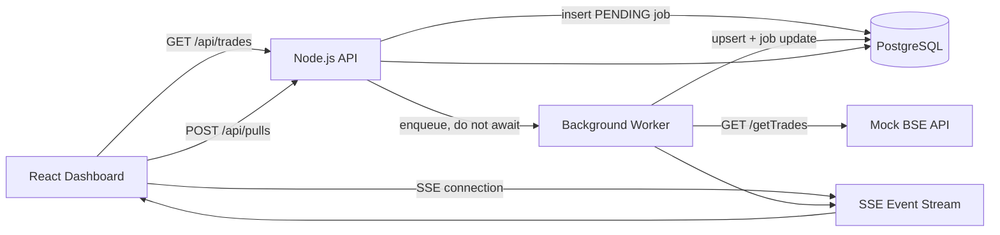
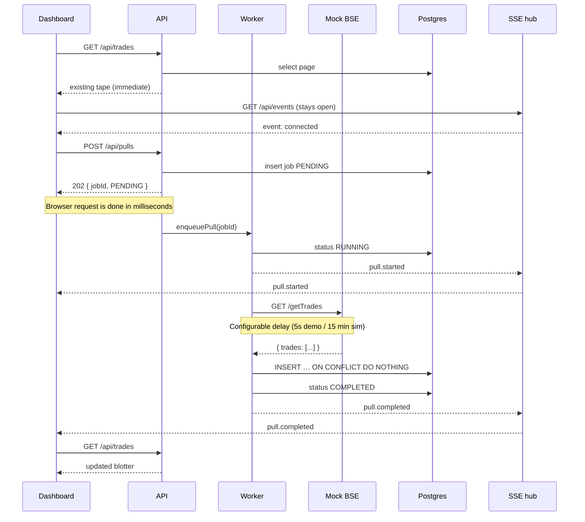

# Architecture

## 1. Problem

We pull trade data from the BSE Exchange API. A full pull takes **up to 15 minutes**. The network **kills any HTTP connection held open longer than 30 seconds**.

The dashboard must:

- Open immediately on trades already stored
- Stay usable while a pull is in progress
- Show new trades when the pull completes
- Use **no page refresh, no polling loop, no cron, no scheduler**

## 2. Why synchronous processing fails

```
Browser
  → HTTP POST /pull
    → Backend
      → BSE  (up to 15 minutes)
        → Response

At t=30s the network tears the connection down.
The user sees a timeout. The pull is wasted. The UI is stuck.
```

The browser/network is the wrong place to wait. The 15-minute operation has to live on the server, in a worker whose lifetime is independent of the tab.

## 3. Proposed architecture

```
Browser
  → POST /api/pulls
    → API creates a pull_jobs row (PENDING)
    → 202 Accepted { jobId, status }
    → Browser request ends          ← this is the 30-second-safe part

Worker (not the browser)
  → mark RUNNING
  → GET /getTrades                  ← this is allowed to take 15 minutes
  → validate payload
  → bulk upsert trades
  → mark COMPLETED
  → publish pull.completed

SSE
  → dashboard receives the event
  → refetch blotter
```

The original browser HTTP request has already finished. SSE is a **different** connection used only to push a small JSON notification. It is not the BSE call.

## 4. Mermaid diagram





## 5. Component responsibilities

| Component | Responsibility |
| --- | --- |
| React dashboard | Render blotter, start pulls, hold an EventSource. Never call `/getTrades`. |
| API (receptionist) | Validate, create job, return 202, refuse a second in-flight pull. |
| Worker (employee) | Own the long BSE HTTP call, validate, persist, update job, publish events. |
| Mock BSE | `GET /getTrades` — seeded Indian-market tape + configurable delay. |
| PostgreSQL | Source of truth for trades and job state. Unique `trade_id`. |
| SSE hub | Fan-out of small events to every open dashboard tab. |

The API is the receptionist. The worker is the processing employee. The receptionist does not stand at the door for 15 minutes.

## 6. Pull lifecycle

```
PENDING  →  RUNNING  →  COMPLETED
                 ↘
                  FAILED
```

Illegal transitions (PENDING→COMPLETED, COMPLETED→RUNNING, …) are rejected in code (`src/lib/jobs/transitions.ts`) and by the `UPDATE … WHERE status =` predicates.

Stale `PENDING`/`RUNNING` rows older than `BSE_DELAY_MS + 60s` are failed **on the next Start Pull** (not by a cron). That recovers a crashed worker without a scheduler.

## 7. Real-time updates

`GET /api/events` is `text/event-stream`.

- `connected` — hello / reconnect
- `pull.started` — job is RUNNING
- `pull.progress` — `calling_bse` / `persisting`
- `pull.completed` — refetch blotter
- `pull.failed` — surface the error

Heartbeat: SSE comment `: keepalive` every 15 seconds so proxies do not idle-timeout the stream. That interval is **server keep-alive**, not browser polling of job status.

Why SSE instead of WebSockets: the data flow is server→browser. SSE is one-way, auto-reconnects natively, and is simpler. WebSockets would work; they are unnecessary here.

Multiple tabs: each EventSource is a subscriber on an in-process set. Every tab gets the event.

Disconnect: EventSource reconnects. On the next `connected`, the dashboard invalidates queries once so a missed event is recovered.

## 8. Failure handling

| Failure | Behaviour |
| --- | --- |
| BSE HTTP non-2xx / timeout | Job RUNNING→FAILED, SSE `pull.failed` |
| Invalid BSE JSON | Zod validation fails the job **before** persistence |
| Database error mid-upsert | Job FAILED. Inserts are idempotent (`ON CONFLICT DO NOTHING`); a later pull completes the set |
| Worker process crash | Job may stay RUNNING until stale recovery on the next Start Pull |
| SSE drop | Native reconnect + one refetch |
| Second Start Pull | `409 Conflict` with the active `jobId` |

Retries: this in-process worker does **not** auto-retry like BullMQ. The user starts a new pull. Because upserts are idempotent, retry is safe.

## 9. Data integrity

`trades.trade_id` is unique.

Pull 1: `TRD001, TRD002, TRD003`
Pull 2: `TRD002, TRD003, TRD004`

The table contains each id once. Implementation: bulk `INSERT … ON CONFLICT (trade_id) DO NOTHING`. Seed uses the same generator as BSE (indices 1–2000 overlap 1–3500), so the first demo pull visibly skips duplicates and inserts the remainder.

Partial failure: batches of 200. A later batch can fail after earlier batches committed. We still mark the job FAILED (we do not report success). A subsequent pull inserts only the missing ids. We prefer this over a 3,500-row all-or-nothing statement that some embedded engines struggle with, and we document it rather than claiming a full serializable transaction we do not have on the pooled driver.

## 10. Scalability

What this process can do today:

- One Node process: API + worker + SSE hub + mock BSE
- Indexed, paginated blotter queries (the browser never downloads the full tape)
- Bulk inserts

What to add when it must scale (not implemented):

- Redis + BullMQ: persisted queue, multiple workers, backoff retries, stalled-job recovery
- Redis pub/sub (or Postgres `LISTEN/NOTIFY` on a non-pooled connection) so SSE is not process-local
- Horizontally scaled API behind a load balancer (stateless except SSE)
- Connection pooling, slow-query logs, traces per `jobId`

## 11. Trade-offs

| Choice | Why | Cost |
| --- | --- | --- |
| In-process worker instead of BullMQ | Evaluator runs one command; still demonstrates 202 + independent work | No distributed durability. A process crash loses the in-flight fetch (job row remains; stale recovery heals) |
| SSE instead of WebSockets | One-way notifications | No client→server messages on that socket (we do not need them) |
| One active pull | Simple accounting, no overlapping upsert races | Throughput of 1 BSE pull at a time |
| Unique tradeId + do-nothing | Exact duplicate definition from the assessment | Cannot update an amended trade; would need a version/hash policy |
| Embedded Postgres in preview | Zero-ops demo | Data resets when the process dies; production uses Neon/Postgres |

We do **not** claim this is a multi-node job platform. We claim the 30-second/15-minute problem is solved, and it is: the browser request does not wait on BSE.
